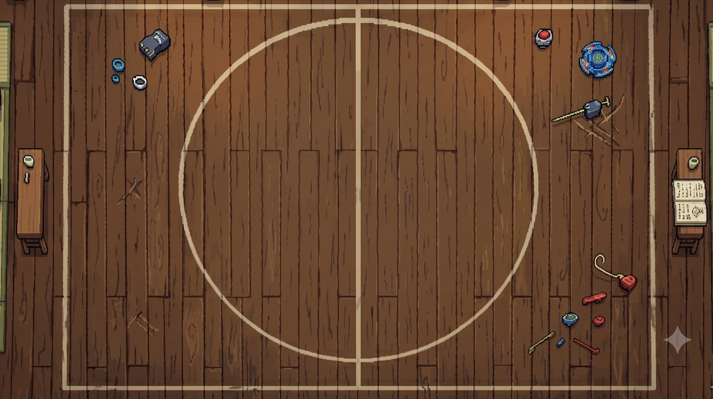
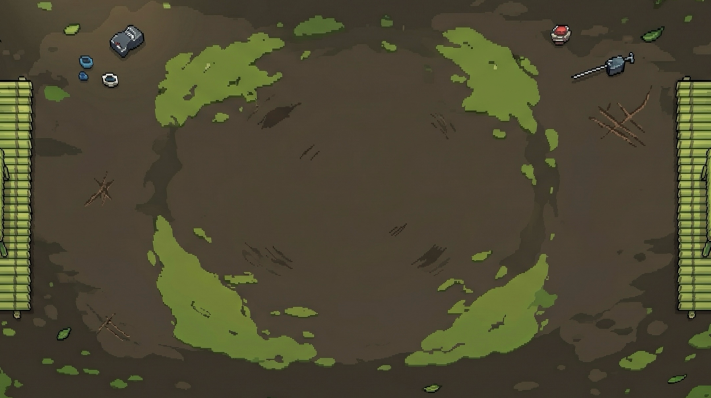
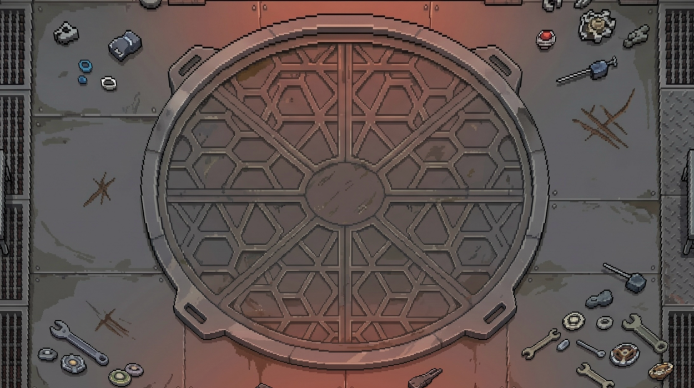
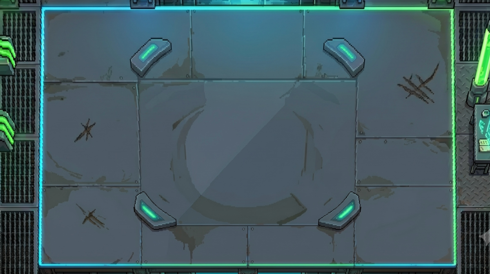
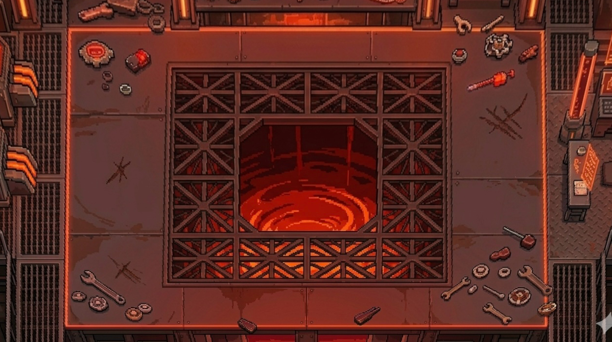

# 陀螺特工 — Beyblade Action Game

> **版本：v23**　｜　Python 3.10+　｜　pygame 2.x

```bash
pip install pygame
python main.py
```

---

## 目錄

1. [遊戲概覽](#遊戲概覽)
2. [操控方式](#操控方式)
3. [核心機制](#核心機制)
4. [關卡介紹](#關卡介紹)
5. [裝備系統](#裝備系統)
6. [Boss 攻略](#boss-攻略)
7. [版本更新紀錄](#版本更新紀錄)
8. [開發者文件](#開發者文件)

---

## 遊戲概覽

《陀螺特工》是一款以陀螺競技為主題的 2D 動作遊戲。玩家操控陀螺在場地中橫衝直撞，透過**碰撞傷害**擊敗敵人，在轉速（RPM）歸零前通關全部五個關卡。

每關勝利後，玩家可從三選一的**裝備獎勵**中選擇強化，打造專屬流派——從坦克型慢磨到玻璃炮一擊必殺，風格由你決定。

---

## 操控方式

| 按鍵 | 功能 |
|------|------|
| `W / ↑` | 向上移動 |
| `S / ↓` | 向下移動 |
| `A / ←` | 向左移動 |
| `D / →` | 向右移動 |
| 滑鼠左鍵（畫圓） | **旋轉補充 RPM**（沿任意方向畫圓圈） |
| `Space / Enter` | 選單確認 |

> **旋轉補充技巧**：以滑鼠在陀螺附近畫大圓圈，每完成一圈補充 85 RPM。轉速越高，攻擊力越強、不容易被彈飛。

---

## 核心機制

### 轉速（RPM）系統

- 遊戲開始時 RPM = **800**，上限 1000。
- RPM 每秒自然衰減（基礎 22 RPM/s），受材質與武器影響。
- RPM 歸零 → **Game Over**。
- 持續畫圓可補充轉速，建議邊移動邊旋轉滑鼠維持高轉速。

### 爆擊系統

玩家與敵人的**相對速度 ≥ 420 px/s** 時觸發爆擊，傷害倍率 **×2**。高速衝刺後撞擊能大幅提升輸出。

### 武器碰撞

- **本體碰撞**（Body Hit）：玩家圓形與敵人重疊，造成完整攻擊力傷害。
- **武器延伸碰撞**（Weapon Hit）：攻擊半徑延伸區域命中，傷害為本體的 **30%**，但安全距離更大。

### 彈射物理

被敵人撞飛的距離受以下因素影響：
- **材質**：鈦合金最易被彈，木頭最穩。
- **配件**：axis 減少被彈距離，recoil_dampener Drive 同樣有效。
- **速度差**：高速碰撞，彈飛距離更遠（最高 2× 速度倍率）。

---

## 關卡介紹

### 第一關 — 滾石場



**目標：** 累積 EXP 達到 **100**

**場地特徵：** 空曠的岩石場地，敵人從場地邊緣滾入。

**敵人介紹：**

| 敵人 | HP | ATK | 行為 | 威脅度 |
|------|-----|-----|------|--------|
| 木頭碎片 (WoodChip) | 3 | 10 | 追蹤玩家，速度慢 | ⭐ |
| 鐵釘 (IronNail) | 5 | 30 | 直線飛行後靜止，干擾路線 | ⭐⭐ |
| 滾石 (RollingStone) | 14 | 40 | 直線滾動，碰牆反彈 | ⭐⭐⭐ |

**攻略要點：**
- 優先消滅木頭碎片刷 EXP，避免鐵釘卡住移動路線。
- 滾石傷害高（40）、本體難以擊退（knockback 抵抗 ×2.5），注意迴避，從側面或尾隨角度補刀。
- EXP 達 35 後場地會持續生成更多滾石，注意場面控制。
- 本關結束後可選擇第一件裝備（**材質**）。

---

### 第二關 — 竹林陣



**目標：** 累積 EXP 達到 **100**

**場地特徵：** 竹林陣地，竹筍會逐漸硬化成不可摧毀的柱子。

**敵人介紹：**

| 敵人 | HP | ATK | 狀態 | 持續時間 |
|------|-----|-----|------|----------|
| 軟竹筍 (BambooShoot 軟) | 5 | 15 | 生長中，可擊殺 | 0 ～ 10 秒 |
| 硬竹子 (BambooShoot 硬) | ∞（無敵） | 60 | 不可摧毀柱子 | 10 ～ 25 秒 |
| 龜裂硬竹 | ∞（無敵） | **90** | 即將倒塌（< 6 秒） | 25 ～ 倒塌 |

**關鍵機制：**
- 軟竹筍出現 **10 秒**後自動硬化，硬化後無法傷害，且會推開玩家。
- 硬竹子持續 **15 秒**後自動倒塌消失；倒塌前最後 6 秒進入龜裂狀態，ATK 升至 90，格外危險。
- 場地最多同時存在 3 根硬竹子；3 根達到上限時，軟竹筍不再繼續硬化。

**攻略要點：**
- 看到軟竹筍立刻快速擊殺，避免大量硬化後路線被切斷。
- 硬竹子之間的縫隙會動態變化，保持移動靈活性。
- 龜裂硬竹碰觸傷害最高，記得繞道走。
- 本關結束後可選擇**武器**。

---

### 第三關 — 齒輪廠



**目標：** 累積 EXP 達到 **100**

**場地特徵：** 工業風齒輪廠，多種機械敵人同時活動。

**敵人介紹：**

| 敵人 | HP | ATK | 行為 | 威脅度 |
|------|-----|-----|------|--------|
| 螺絲 (Screw) | 22 | 22 | 高速追蹤（170 px/s） | ⭐⭐ |
| 小齒輪 (Gear S) | 28 | 55 | 沿固定路徑移動；可升級 | ⭐⭐⭐ |
| 中齒輪 (Gear M) | 55 | 112 | 由兩個小齒輪合體升級 | ⭐⭐⭐⭐ |
| 大齒輪 (Gear L) | 90 | **165** | 最大型，高 knockback 抵抗 | ⭐⭐⭐⭐⭐ |
| 鋸刃 (Sawblade) | 50 | **130** | 0.5 秒預警後高速衝刺（500 px/s） | ⭐⭐⭐⭐⭐ |

**攻略要點：**
- **阻止齒輪合體**：小齒輪互相接近時會升級，優先拉開或逐一擊殺。
- **大齒輪（Gear L）**：ATK 高達 165，無裝備下需碰撞 30 次才能擊殺，建議搭配高攻擊材質。
- **鋸刃**：看到紅色預警閃爍時，立刻橫向移動閃開，不要試圖正面抵擋。
- 本關是難度跳躍最大的一關（最高 ATK 比前關高 2.75 倍），帶好前兩關的裝備很關鍵。
- 本關結束後可選擇**配件**。

---

### 第四關 — 綠圈加速場



**目標：** 擊殺 **50 個**敵人

**場地特徵：** 圓形封閉場地（半徑 285px），碰到邊界會被**彈射加速**。

**核心機制 — 彈射加速：**
- 所有陀螺（含敵人）被限制在綠色圓圈邊界內。
- 碰到邊界時，依物理鏡射角度反彈，速度乘以 **1.35×**（上限 800 px/s）。
- **策略**：善用邊界彈射加快移動速度，提高爆擊觸發率。

**敵人介紹：**

| 敵人 | HP | ATK | 行為 | 特點 |
|------|-----|-----|------|------|
| 坦克陀螺 (TankTop) | 200 | 40 | 場地中心緩速繞圈 | 質量 ×4，極難被彈飛 |
| 跑者陀螺 (RunnerTop) | 200 | 25 | 高速繞圈騷擾 | 輕巧，容易被彈 |
| 分裂陀螺 (SplittingTop) | 100→50→25→12 | 20 | 擊殺後分裂成 2 個 | Gen 0 計 1 分，Gen 1 計 0.5 分 |

**攻略要點：**
- 分裂陀螺是刷擊殺數的主力：G0 擊殺 1 分，分裂出的 G1 擊殺各 0.5 分，G2 以後不計分但繼續分裂造成混亂。
- 坦克陀螺質量極重（mass ×4），幾乎打不動，但 ATK 不高，避開即可。
- 每 2.5 秒從場地中心傳送門刷新敵人，場面會越來越亂。
- 本關結束後可選擇**驅動器（Drive）**。

---

### 第五關 — 魔王戰



**目標：** 擊敗 Boss

**場地特徵：** 最終對決場地，初始有 4 顆地雷。

**地雷說明：** 踩到地雷會造成大量傷害，配合 Boss 的移動壓縮玩家空間。

---

## Boss 攻略

Boss 分為三個階段，每次轉換都有短暫無敵 + 環形彈幕爆散，注意退開。

### Phase 1（HP 100% → 70%）

**特徵：** 速度 200 px/s，繞圈半徑 140px，相對從容。

| 攻擊 | 機率 | 說明 |
|------|------|------|
| 衝刺 | 35% | 0.8 秒預警後直衝玩家當前位置 |
| 螺旋彈幕 | 30% | 2 臂旋轉彈幕，持續 2.5 秒 |
| 繞圈 | 20% | 純機動，無攻擊 |
| 環形彈幕 | 15% | 16 顆向外爆散 |

**建議：** 保持移動，衝刺前看到閃爍預警立刻橫移。弄累積衝擊值（連續碰撞 80 點）可觸發 **0.6 秒硬直**，趁機輸出。

---

### Phase 2（HP 70% → 35%）

**特徵：** 速度提升至 ≈ 260 px/s，繞圈半徑縮小至 100px，更難迴避。

| 攻擊 | 機率 | 說明 |
|------|------|------|
| **小陀螺召喚** | 30% | 生成 5 顆 MiniTop 高速衝向玩家 |
| 衝刺 | 25% | 速度 ×1.2，更快 |
| 螺旋彈幕 | 25% | 3 臂，每 0.08 秒一發 |
| 環形彈幕 | 20% | 20 顆向外爆散 |

**小陀螺（MiniTop）：** HP 100、ATK 50、速度 380 px/s。打死 MiniTop 除了減少威脅外，還會**降低 Phase 3 護盾值**，必須優先清場！

**建議：** 召喚 MiniTop 後先繞場把牠們全清掉，再攻擊 Boss。

---

### Phase 3（HP 35% → 0%）

**特徵：** 速度提升至 ≈ 340 px/s，繞圈半徑縮至 70px，地雷增加至 8 顆。

**護盾系統：**
- Phase 3 開始時，護盾 HP = 存活的 MiniTop 數量 **× 1000**。
- 護盾存在時所有傷害優先扣護盾，Boss HP 不變。
- 護盾存在時顯示**金黃色脈衝光圈**和獨立血條。
- **所以 Phase 2 清 MiniTop 越多，Phase 3 護盾越低！**

| 攻擊 | 機率 | 說明 |
|------|------|------|
| 衝刺 | 20% | |
| **雷射** | 20% | 持續傷害光束，只扣血不彈開 |
| 螺旋彈幕 | 20% | 4 臂，密集 |
| 環形彈幕 | 20% | 24 顆 |
| 追蹤彈幕 | 20% | 12 顆追蹤彈 |

**蓄力爆炸（每 9 秒）：** Boss 高速自轉 2 秒後向四方射出 12～18 顆碎片（各 35 傷害）。看到 Boss 原地自轉時立刻拉開距離。

**激怒（Enrage，60 秒無擊殺）：** 速度再 ×1.4，所有技能冷卻大幅縮短。優先打傷害，別拖時間。

**硬直數值：**
| 階段 | 閾值 | 硬直時間 |
|------|------|----------|
| Phase 1 | 80 | 0.6 秒 |
| Phase 2 | 140 | 0.4 秒 |
| Phase 3 | 220 | 0.3 秒 |

> 注意：彈幕（螺旋 / 環形 / 追蹤 / 雷射 / 碎片）命中玩家時**只扣血，不彈開**，可以站著硬吃，但 RPM 會持續耗損。

---

## 裝備系統

每關勝利後可在獎勵畫面三選一，每次解鎖一個裝備槽。

### 關卡對應裝備槽

| 完成關卡 | 解鎖裝備槽 |
|----------|-----------|
| 第一關 | 材質 (Material) |
| 第二關 | 武器 (Weapon) |
| 第三關 | 配件 (Accessory) |
| 第四關 | 驅動器 (Drive) |
| 第五關通關 | 核心 (Core)（結算獎勵） |

---

### 材質（Material）

| 材質 | 攻擊倍率 | 衰減倍率 | 被彈倍率 | 定位 |
|------|---------|---------|---------|------|
| 木頭 (Wood) | ×0.8 | ×0.90 | ×1.1 | 耐久型——攻弱守優，RPM 衰減最慢 |
| 鋼鐵 (Steel) | ×1.2 | ×1.05 | ×0.85 | 均衡型——攻防皆優，最穩定 |
| 鈦合金 (Titan) | ×1.5 | ×1.18 | ×1.3 | 玻璃炮——攻擊最強但容易被彈飛 |

---

### 武器（Weapon）

| 武器 | 碰撞方向 | 延伸射程 | 懲罰 | 適合流派 |
|------|---------|---------|------|---------|
| 鐮刀 (Scythe) | 2 方向 | 16 px | 無 | 前壓控制型 |
| 金箍棒 (Staff) | 4 方向 | 28 px | 無 | 靈活校準型，覆蓋面最廣 |
| 重鎚 (Hammer) | 1 方向 | 36 px | 衰減 ×1.15，RPM 補充 ÷2 | 爆發型——極高傷害但 RPM 難維持 |

> **重鎚注意**：和鋼鐵或鈦合金搭配時，RPM 補充效率過低幾乎無法長期維持，建議搭配木頭材質使用。

---

### 配件（Accessory）

| 配件 | 效果 | 定位 |
|------|------|------|
| 穩定軸 (Axis) | 受傷 -25%，被彈 ×0.75 | 純防禦，消極生存 |
| 咬合環 (Gear Ring) | 每次攻擊額外 +5 傷害，受傷 -15%，被彈 ×0.85 | 攻防兼備，CP 值最高 |
| 衝刺膠帶 (Dash Tape) | 持續移動 2.5 秒後觸發衝刺（600 px/s，0.33 秒），衝刺中免疫位移 | 高操作上限，機動型 |

---

### 驅動器（Drive）

| 驅動器 | 效果 | 定位 |
|--------|------|------|
| 反震阻尼 (Recoil Dampener) | 被彈距離 ×0.55，碰後 0.3 秒受傷 -15% | 生存型，減少失控 |
| 衝擊波 (Shockwave) | 每次碰撞對 120px 範圍所有敵人造成 15 額外傷害 | 清場型，群體輸出 |
| 碎片殘響 (Splinter Echo) | 每次碰撞 40% 機率生成殘影，殘影持續 2 秒並造成 5 傷害 | 雪球型，Boss 戰尤其強力 |

---

### 核心（Core）

核心在第五關通關後的結算畫面中展示，影響玩家人格稱號。

| 核心 | 效果 | 定位 |
|------|------|------|
| 護盾 (Shield) | 每次受傷 30% 機率完全免疫 | 期望值等效 -30% 傷害，穩健防禦 |
| 王冠 (Crown) | RPM < 30%（300）時攻擊最高 ×1.5，被彈最高 ×1.2 | 高風險高回報，轉速越低越強 |
| 混沌 (Chaos) | 被彈開方向隨機偏移 ±15° | 隨機型，增加走位不可預測性 |

---

## 版本更新紀錄

### v20（目前版本）

| # | 類別 | 說明 |
|---|------|------|
| 1 | Bug 修正 | 第二關死亡硬竹子不再佔用竹筍生成位置 |
| 2 | 第四關 | 綠圈碰撞改為物理鏡射反射，加入 1.35× 彈射加速（上限 800 px/s） |
| 3 | 第五關 | 所有彈幕（子彈 / 碎片 / 雷射）命中玩家時不再產生 knockback |
| 4 | 第五關 Phase 1 | 移除 Phase 1→2 轉換時的 Sawblade 生成 |
| 5 | 第五關 Phase 2 | 移除技能吸取機制；移除雷射攻擊；移除地雷召喚增加 |
| 6 | 第五關 Phase 2 | 新增小陀螺召喚攻擊（MiniTop，佔 30% 攻擊池） |
| 7 | 第五關 Phase 2→3 | 移除 RPM 吸取演出 |
| 8 | 第五關 Phase 3 | 移除場地縮小機制 |
| 9 | 第五關 Phase 3 | 新增護盾系統（存活 MiniTop × 1000 HP，金黃光圈視覺） |

---

## 開發者文件

### 目錄結構

```
beyblade_agent_final/
├── main.py           — 主遊戲迴圈、狀態機、輸入處理
├── enemies.py        — 所有敵人類別 + Boss 三階段系統
├── player.py         — 玩家物理、裝備效果、碰撞回應
├── level_manager.py  — 關卡初始化、敵人生成、碰撞偵測
├── screens.py        — 主選單、獎勵選擇、結算畫面
├── hud.py            — 遊戲內 HUD 繪製（血條、通知）
├── scenes.py         — 場地背景繪製
├── particles.py      — 粒子特效（火花、殘影、衝擊環）
├── draw_utils.py     — 通用繪圖工具函式
├── colors.py         — 全域顏色常數
├── constants.py      — 全域遊戲常數（場地大小、速度等）
├── audio_manager.py  — 音效管理（材質碰撞音分派）
├── spin_detector.py  — 旋轉方向偵測（羅盤輸出）
└── audio/            — .wav 音效資源
```

---

### 狀態機（main.py）

```
STATE_TITLE → STATE_PLAYING → STATE_REWARD → STATE_PLAYING（下一關）
                    ↓                              ↓
              STATE_GAMEOVER              STATE_CLEAR_ANIM
```

每幀流程：
1. `player.update(keys, dt)` — 移動、摩擦、碰撞牆壁
2. `boss.update(dt, px, py)` — Boss AI，回傳 signals dict
3. `level_manager.update(dt)` — 敵人更新、碰撞偵測、信號處理
4. 繪製：場地 → 敵人 → 粒子 → 玩家 → HUD

---

### LevelManager 碰撞系統

`_check_hit(player, enemy)` 回傳 `(body_hit, weapon_hit)` 兩個布林：
- **body_hit**：玩家本體（圓）與敵人（圓）重疊
- **weapon_hit**：玩家武器延伸半徑（`effective_reach()`）碰到敵人，傷害為本體的 30%

碰撞結果：
- 敵人受 `player.effective_attack()` 傷害
- 玩家受 `e.attack` 傷害，並依碰撞方向被彈開（knockback）
- 例外：Boss 子彈 / 碎片 / 雷射命中玩家時**只扣血，不彈開**（`no_knockback=True`）

---

### 玩家物理（player.py）

| 參數 | 說明 |
|---|---|
| `rpm` / `rpm_max` | 當前 / 最大轉速，歸零即 Game Over |
| `vx`, `vy` | 速度向量，直接控制位移 |
| `stun_timer` | 受擊後短暫無敵期（`STUN_DURATION`） |
| `invincible_timer` | 衝刺中或受擊後較長無敵期 |

---

### 彈幕傷害規則

| 傷害來源 | 推開玩家（knockback） |
|---|---|
| 一般敵人碰撞 | ✅ 是 |
| MiniTop 碰撞 | ✅ 是 |
| Boss 直接衝刺碰撞 | ✅ 是 |
| Boss 子彈（螺旋 / 環形 / 追蹤） | ❌ 否，只扣血 |
| Boss 爆炸碎片 | ❌ 否，只扣血 |
| Boss 雷射（Phase 3） | ❌ 否，只扣血 |

---

### 稱號系統（screens.py）

通關後結算畫面依玩家裝備組合顯示心理人格稱號。

**維度計分：**
- `AGGR`（攻擊傾向）/ `SURV`（防禦傾向）/ `CTRL`（控制傾向）
- `TEMPO`（節奏感）/ `FLEX`（彈性）/ `RISK`（風險偏好）

分數最高的兩個維度決定稱號描述。

---

### 音效系統（audio_manager.py）

依材質和關卡分派碰撞音效：
- `wood` → `wood.wav`
- `steel` / `plastic` → `plastic.wav`
- 有武器的木頭材質 → `clash_trimmed.wav`（刀鋒碰撞）

每次碰撞有冷卻期（`HIT_SFX_COOLDOWN`）防止音效堆疊。
